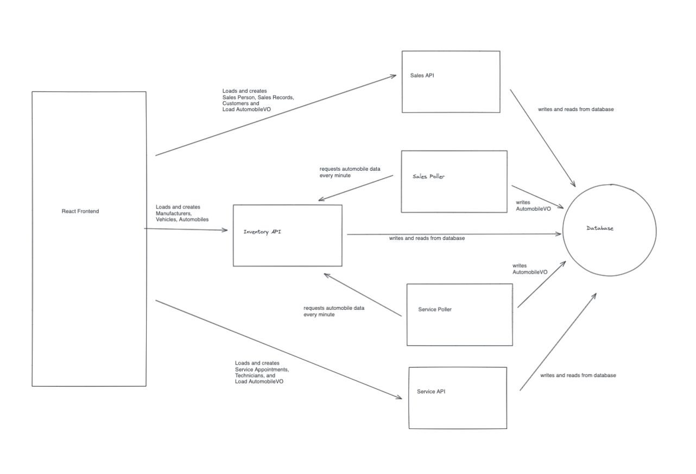

# CarCar

## Team

- **Wilson** - Sales microservice Lead
  - Sales Backend All
  - Frontend: SalesRecordForm, SalesHistory
- **Yehsun** - Services microservice Lead
  - Sevices Backend All
  - Frontend: AppointmentForm, AppointmentList, ServiceHistory
- **Junella** - Frontend Lead
  - Frontend
    - Inventory: All
    - Sales frontend: SalesPersonForm, CustomerForm
    - Service frontend: TechnicianForm
    - Navbar design
  - Backend - Assist with troubleshooting

## System diagram



## Design

### Service microservice

Explain your models and integration with the inventory microservice, here:

Models ([Source file](./service/api/service_rest/models.py))

Based on [LEARN requirements and screenshots](https://learn-2.galvanize.com/cohorts/3283/blocks/1890/content_files/build/01-practice-test-project/67-assessment-project.md) each property in the models are mapped to a column of the screenshots.

🌼🌼🌼 For the AutomobileVO, I used the pattern of having an `import_href` property based on previous class projects. The property of
`vip` is not noted in the front-end screenshots from LEARN, but was added due to the requirement of recording if the automobile was purchased from the delearship or not. null=True have been added to some of the properties to overcome hurdles from making migrations after instances had already been created during development. Prior to official deployment, these will be adjusted as those fields are a requirements when creating automobiles and should already exist when polling those automobile instances from the Inventory API to create the AutomobileVOs.

```python
class AutomobileVO(models.Model):
    import_href= models.CharField(unique= True, max_length=200)
    vin = models.CharField(unique=True,max_length=200)
    color = models.CharField(null= True, max_length=200)
    year = models.IntegerField(null=True)
    model = models.CharField(null=True, max_length=200)
    vip = models.BooleanField (default=True)
```

Per [specification](https://learn-2.galvanize.com/cohorts/3283/blocks/1890/content_files/build/01-practice-test-project/67-assessment-project.md) in the `Enter a Technician` section, I gave Technicians a name
and employee number. 🌼🌼🌼 I chose integer for the employee number, assuming it'll
always be a number and not start off with zeroes (eg. `00123`).

```python
class Technician(models.Model):
    name = models.CharField(max_length=200, unique=True)
    employee_number = models.IntegerField(unique=True, null=True)
```

Per [specification](https://learn-2.galvanize.com/cohorts/3283/blocks/1890/content_files/build/01-practice-test-project/67-assessment-project.md) from the `List of Appointments` section, 🌼🌼🌼 I built a Status model to note whether an automobile service is currently "Scheduled", "Finished", or has been "Canceled". In the next section of this README, you will see the Status is connected to the Service model via a ForeignKey, as a Status can have many Services, but a Service can only have one Status at a time.

```python
class Status(models.Model):
    name = models.CharField(max_length=200)

    def __str__(self):
        return self.name
```

Per [specification](https://learn-2.galvanize.com/cohorts/3283/blocks/1890/content_files/build/01-practice-test-project/67-assessment-project.md) in the `Enter a Service Appointment` section, 🌼🌼🌼 I have created properties needed for the concierge. I made `vin` have a character field, and not an integer because a VIN will need to include alphabet characters. `Date` and `Time` are separate properties for clear separation in terms of the database columns. There is a ForeignKey connection with `Technician` under the assumption that a Technician can have many Services, but a Service instance will only be worked on by one Technician. The `on_delete` is set to PROTECT so that if the technician is removed from the system, the history of the service is still available. The methods `cancel`, `finish` are linked to the Status but within this service model because we want to be able to update the status for a specific instance of Service and it seems more logical to handle that within the instance of the model on the many side of the one-to-many relationship.

```python
class Service(models.Model):
    vin = models.CharField(unique=True,max_length=200)
    customer_name = models.CharField(max_length=200)
    date = models.DateTimeField(auto_now_add=True)
    time = models.DateTimeField(auto_now_add=True)
    technician = models.ForeignKey(
        Technician,
        related_name="services",
        on_delete=models.PROTECT
        )
    reason = models.CharField(max_length=200)
    status = models.ForeignKey(
        Status,
        null= True,
        related_name="services",
        on_delete=models.PROTECT,
        default=1,
        )

    def cancel(self):
        status= Status.object.get(name="cancelled")
        self.status= status
        self.save()

    def finish(self):
        status= Status.object.get(name="finished")
        self.status= status
        self.save()

    def get_api_url(self):
        return reverse("api_list_services", kwargs={"pk": self.vin})

    def __str__(self):
        return self.vin

    class Meta:
        verbose_name_plural = "Services"


    @classmethod
    def create(cls, **kwargs):
        kwargs["status"] = Status.objects.get(name="Scheduled")
        appointment = cls(**kwargs)
        appointment.save()
        return appointment
```

### Integration with inventory micro-service

Every 60 seconds, the services-poller polls for automobiles from inventory API
via the `GET` method to poll from `/"http://inventory-api:8000/api/automobiles/"` URL. It then converts that into an AutomobileVO and
stores it in the database. ([Source file](./service/api/service_rest/poller.py))

### Sales microservice

Explain your models and integration with the inventory
microservice, here.

Models ([Source file](./service/api/sales_rest/models.py))

Based on [LEARN requirements and screenshots](https://learn-2.galvanize.com/cohorts/3283/blocks/1890/content_files/build/01-practice-test-project/68-assessment-project.md) each property in the models are mapped to a column of the screenshots.

For AutomobileVO, 🚨🚨🚨 I have `vin` and `name` properties, because those are properties that will be needed for creating a Sales Record. The `is_sold` property is not shown in the example screenshots, but is a part of the requirements that states a Sales Record should associate an automobile that has not yet been sold from inventory.

```python
class AutomobileVO(models.Model):
    vin = models.CharField(max_length=20, unique=True)
    name = models.CharField(max_length=100, null=True, blank=True)
    is_sold = models.BooleanField(default=False, blank=True, null=True)


    def __str__(self):
        return f"{self.vin} {self.name}"
```

Per [specification](https://learn-2.galvanize.com/cohorts/3283/blocks/1890/content_files/build/01-practice-test-project/68-assessment-project.md) in the `Add a Sales Person` section, 🚨🚨🚨 I have added the properties of `employee_name` and `employee_num`. PositiveSmallIntegerField was chose for employee_num under the assumption that an employee number will always be greater than zero,won't exceed 32767, and won't include alphabet characters.

```python
class SalesPerson(models.Model):
    employee_name = models.CharField(max_length= 100)
    employee_num = models.PositiveSmallIntegerField(null=False, blank=False, unique=True)

    def __str__(self):
        return f"{self.employee_name}"
```

Per [specification](https://learn-2.galvanize.com/cohorts/3283/blocks/1890/content_files/build/01-practice-test-project/68-assessment-project.md) in the `Add a Potential Customer` section, the Customer model was given properties of `customer_name`, `address`, and `phone_number`. 🚨🚨🚨 The phone_number property was assigned unique=True, under the assumption that customers do not share a phone number with another customer.

```python
class Customer(models.Model):
    customer_name = models.CharField(max_length=100)
    address = models.CharField(max_length=200)
    phone_number = models.CharField(max_length=17, unique=True, null=False, blank=False)

    def __str__(self):
        return f"{self.customer_name}"
```

Per [specification](https://learn-2.galvanize.com/cohorts/3283/blocks/1890/content_files/build/01-practice-test-project/68-assessment-project.md) in the `Create a Sale Record` section, 🚨🚨🚨 I have added properties for the `automobile`, `sales_person`, and `customer` that are all connected to their respective models via the ForeignKey because each of those models can have many Sales Records, but a Sale Record can only be tied to a single instance from each of those models. They are also set to PROTECT on_delete so that if any of the instances from the other models were to be removed, there will still be record of the sale. `price` is also included as a property per the specification of a Sales Record.

```python
class SalesRecord(models.Model):
    automobile = models.ForeignKey(AutomobileVO, on_delete=models.PROTECT)
    sales_person = models.ForeignKey(SalesPerson, on_delete=models.PROTECT)
    customer = models.ForeignKey(Customer, on_delete=models.PROTECT)
    price = models.PositiveIntegerField(null=False, blank=False)

    def __str__(self):
        return f"{self.automobile}"
```

### Integration with inventory micro-service

Every 60 seconds, the services-poller polls for automobiles from inventory API
via the `GET` method to poll from `/"http://inventory-api:8000/api/automobiles/"` URL. It then converts that into an AutomobileVO and
stores it in the database. ([Source file](./service/api/sales_rest/poller.py))

### Bounded contexts
